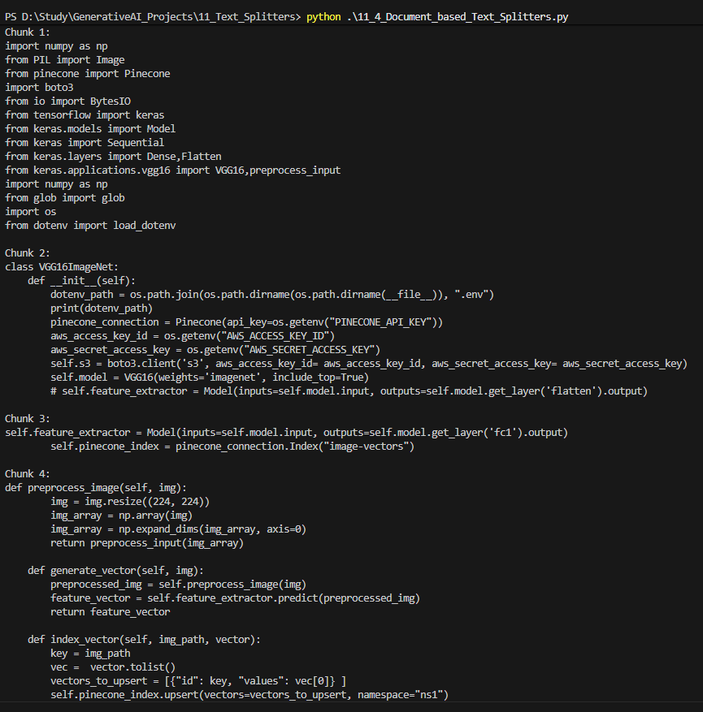
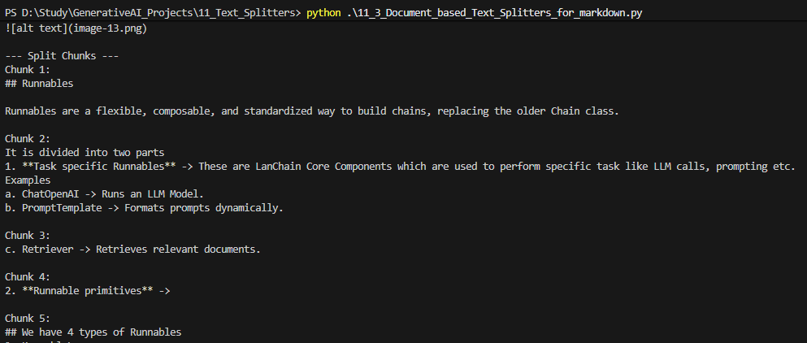

## Text Splitter

### 1. Length Based Splitter

It splits the text of text or pdf document based on the number of characters passed as input

Output of  Text document \n

\n Output of  PDF document\n

### 2. TextStructured Based Splitter

We observe how the input text is organized, like its organized at paragaraph level or at sentence level or at line level and finally at word level.
Accordingly splitting of text is done.
Text is splitted first at Word level, then at Line level , then at sentence level and finally at Paragraph level so that context of the text is not lost and the text after splitting remains meaningful.

### 3. Document_based_Text_Splitters

It is used to split documents which does not contain regular text like markup readme file, code.
A python program cannot be splitted using conventional split technique to maintain the sanctity of the code
To split we will  use RecursiveCharacterTextSplitter.from_language where language is python to split knowing it is a python code
<!-- splitter = RecursiveCharacterTextSplitter.from_language(
    language= Language.PYTHON,
    chunk_size = 700,
    chunk_overlap = 0,
) -->

Splitting Markdown file using same RecursiveCharacterTextSplitter.from_language but
<!-- splitter = RecursiveCharacterTextSplitter.from_language(
    language= Language.MARKDOWN,
    chunk_size = 300,
    chunk_overlap = 0,
) -->
