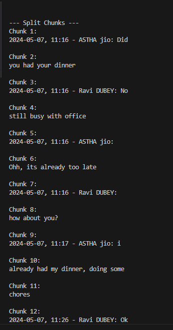
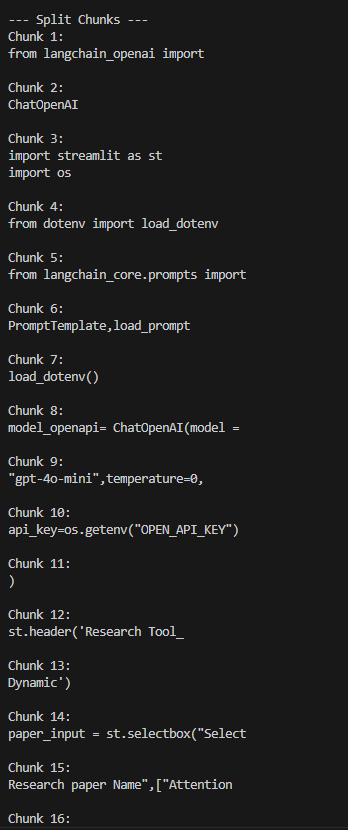

## Text Splitter

### 1. Length Based Splitter

Output of  Text document \n

\n Output of  PDF document\n

### 2. TextStructured Based Splitter
Text is splitted first at Word level, then at Line level and finally at Paragraph level so that context of the text is not lost.
The text after splitting remains meaningful.

### 3. Document_based_Text_Splitters

It is used to split documents which does not contain regular text. 
A python program cannot be splitted using conventional split technique to maintain the sanctity of the code
To split we will still use RecursiveCharacterTextSplitter

