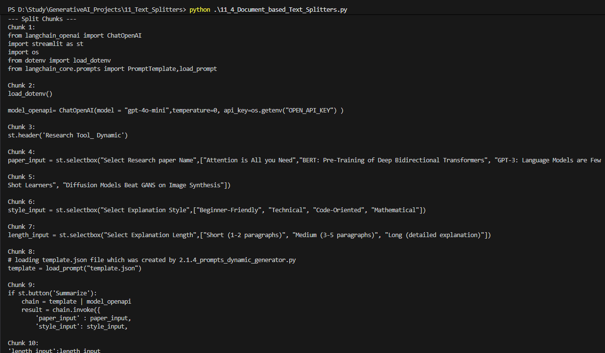
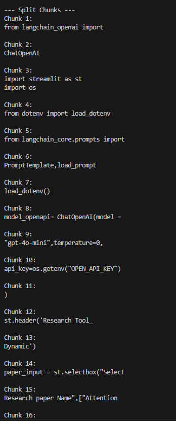

## Runnables

Runnables are a flexible, composable, and standardized way to build chains, replacing the older Chain class.

It is divided into two parts
1. **Task specific Runnables** -> These are LanChain Core Components which are used to perform specific task like LLM calls, prompting etc.
Examples
a. ChatOpenAI -> Runs an LLM Model.
b. PromptTemplate -> Formats prompts dynamically.
c. Retriever -> Retrieves relevant documents.

2. **Runnable primitives** -> 

## We have 4 types of Runnables
1. RunnableSequence
2. RunnableParallel

### 1 RunnableSequence()

It is a sequential chain of runnable which simply executes step in a sequence, passing the output of one step as input to the next. Generally used when we need to compose multiple runnables together in a structured flow.

chain = RunnableSequence(prompt1,model_openapi,string_parser,prompt2,model_openapi,string_parser)

On running code we get below output

### 2 RunnableParallel
It is a runnable Primitive that allows multiple runnables to execute in parallel. Each runnable receives the same input and process it independently and in parallel sequence, producing a dictionary of outputs.

parallel_chain = RunnableParallel({
 'tweet': RunnableSequence(promptX,model_openapi,string_parser), 
'LinkedIn' : RunnableSequence(promptL,model_openapi,string_parser)})

On running code we get below output

### 3. RunnablePassthrough
It returns input as output. Very helpful when we also want the output from LLM in its originality along with some processing done on input.
Eg:
When we want to get a Joke and the explanation of the joke in such case, original joke can be retrieved using RunnablePassthrough while explanation can be retrieved using RunnableSequence.

joke_gen_chain= RunnableSequence(prompt1,model_openapi,string_parser)
parallel_chain = RunnableParallel(
{ 'Joke': RunnablePassthrough(),'Explanation' : RunnableSequence(prompt2,model_openapi,string_parser)})
final_chain = RunnableSequence(joke_gen_chain,parallel_chain)

On running code we get below output

### 4. RunnableLambda
It allows us to apply custom Python functions within an AI pipeline. It acts as a middleware between different AI components, enabling preprocessing, transformation, API calls, filtering, and post-processing in a Langchain workflow.

Eg:
When we want to get a Joke and also count the number of words in the joke in such case, original joke can be retrieved using RunnablePassthrough while explanation can be retrieved using RunnableSequence.

joke_gen_chain = RunnableSequence(prompt1,model_openapi,string_parser)

parallel_chain = RunnableParallel({ ‘Joke’: RunnablePassthrough(),‘count’ :RunnableLambda(lambda x : word_counter(x))})

final_chain = RunnableSequence(joke_gen_chain,parallel_chain)

On running code we get below output

### 5. RunnableBranch

It allows to conditionally route input data to different chains or runnables based on custom logic. It is like a if/elif/else block for chains, where we define a set of conditional functions and each function is associated with a runnable.
Eg:
If we get customer email then LLM needs to analyze the nature of request in the email and route to appropriate team/BOT to handle it.

Runnable Branch Flow for above use case would be

branch_chain = RunnableBranch(
    (lambda x:x.Sentiment == 'Positive', positive_sentiment),
    (lambda x:x.Sentiment == 'Negative', negative_sentiment),
    RunnableLambda(lambda x: " Could not find the sentiment from the given Feedback")
)

On running code we get below output
