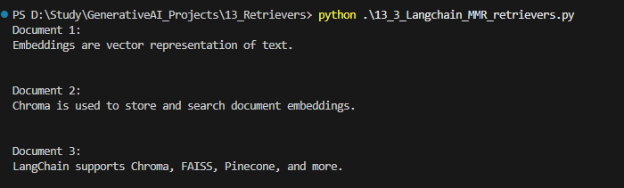
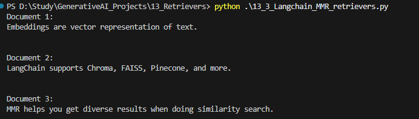
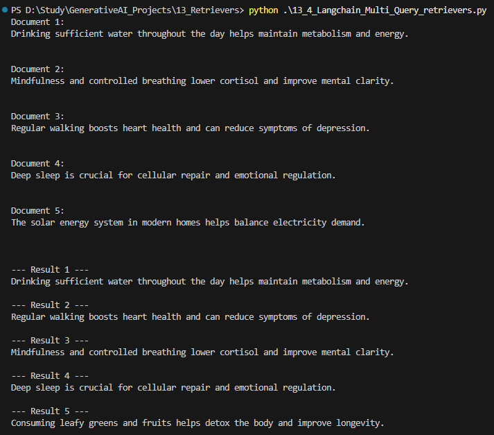
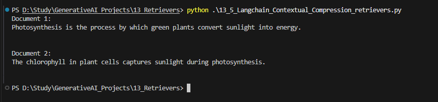

## Retrievers

Documentation for retrievers can be found at below location

https://medium.com/p/88d42e0a2ace/edit

### 1. Wikipedia Retriever

### 2. VectorStore Retriever

### 3. MMR 

with "lambda_mult": 1 we get results like similarity search

with "lambda_mult": 0.5 we get diverse results

### 4. MultiQuery Retriever

### 5. Contextual Compression  Retriever

