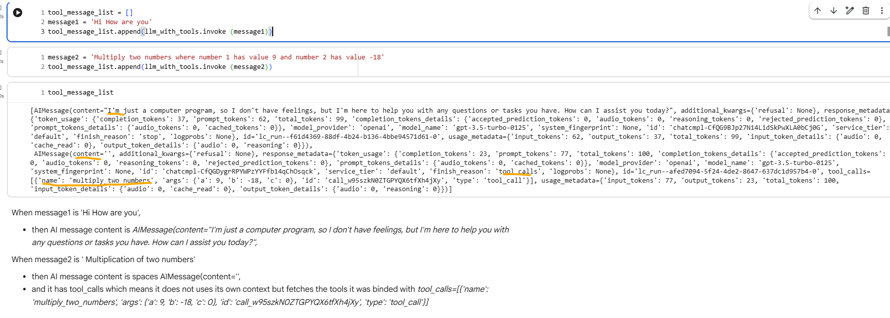
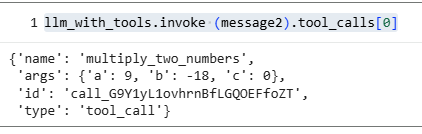

# Langchain Tools

## 1. Built-In Tools
Built in tools defined by LangChain itself.


## 2. Custom Tool 
These are custom build tools, built by us

a. Personalized function name — in this case `multiply_numbers_ravi`  
b. Decorator to define a tool so it can be called from the LLM  
c. Type hinting to clearly specify input and output data types  
d. Docstring to help the LLM understand what the function does  

```python
@tool  
def multiply_numbers_ravi(a: int, b: int) -> int: 
    """Multiplies two numbers.""" 
    return a * b  
```

 LLM sees below schema when it reaches to the tool multiply_numbers_ravi.

```json
{
   "description":"Multiplies two numbers.",
   "properties":{
      "a":{
         "title":"A",
         "type":"integer"
      },
      "b":{
         "title":"B",
         "type":"integer"
      }
   },
   "required":[
      "a",
      "b"
   ],
   "title":"multiply_numbers_ravi",
   "type":"object"
}
```


## 3. Structured Tools

It is a special type of tool where the input to the tool follows a structured schema, typically defined using a Pydantic model.

a. From Pydantic, Inherited Base Model function `MultiplyNumbersInput`  strictly enforce the input and output data type.
b. Personalized function  `multiply_numbers_structured_ravi`  which does the multiplication operations.
c. Final function `multiply_tool` will be Structured tool function which will have func =  Personalized function `multiply_numbers_structured_ravi`
    and args_schema = Base Model function  `MultiplyNumbersInput`. Description is mandatory in it.

```python
multiply_tool = StructuredTool.from_function(
    func = multiply_numbers_structured_ravi,
    name = "multiply_numbers_structured_ravi",
    description = "Multiplies two numbers",
    args_schema = MultiplyNumbersInput
    )

```

## 4. Base Tools

Its abstract base class for all tools in LangChain which defines core structure and interface for any tool to follow.
Tools like Built-In Tools, Custom Tool, and StructuredTool are built on top of BaseTool.

a. From Pydantic, Inherited Base Model function `MultiplyNumbersInput_new`  strictly enforce the input and output data type.
b. Final function `MultiplyTool_New` will be inherit Base tool function which has func =  '_run' which does the multiplication operation
    and args_schema = Base Model function  `MultiplyNumbersInput_new`. Description is mandatory in it.

``` python
class MultiplyTool_New(BaseTool):
  name: str = "multiply_numbers_ravi"
  description: str = "Multiplies two numbers"
  args_schema: Type[BaseModel] = MultiplyNumbersInput_new
  def _run(self, a: int, b: int, c: int) -> int:
    c = a * b
    return c
```


# Tool Binding

Its is step where we registers **Custom** or **Structured** tools with LLM so that 
a. LLM knows what all tools are available for its `functioning`.
b. LLM knows what each tools `does`.
c. LLM knows what `input format` to use for each tools. This is done via reading the schema of the tools.


# Tool Calling

It is the process whre the LLM decides, during a conversation or task, that it needs to use a specific tool(function) 
and generates a structured output(Schema) which has following: </br>

a. the `name of the tool`
b. and the `arguments` to call it with

The LLM does not run the tool, it just suggest the tool and the input argument. The actual execution is handled by **LanChain**.


 </br>



As we can see in above images, LLM gets the name of the tool and the arguments
