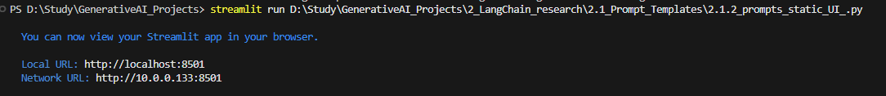
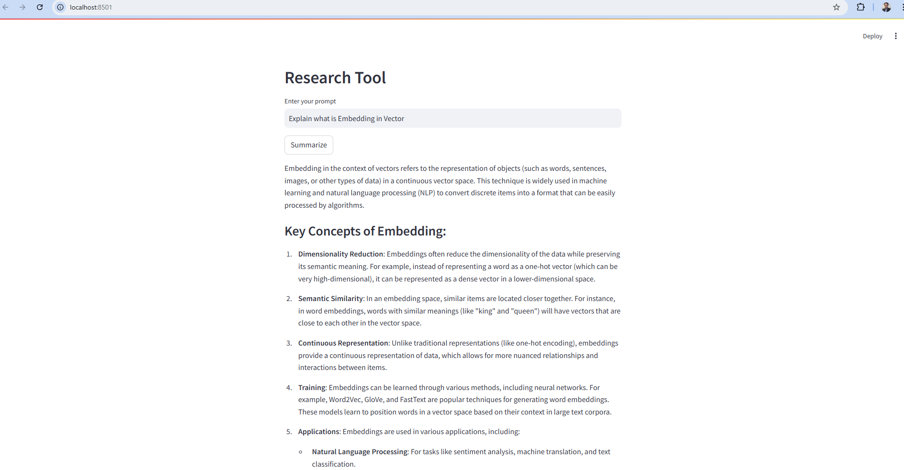
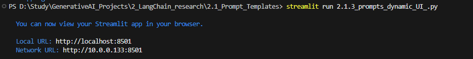
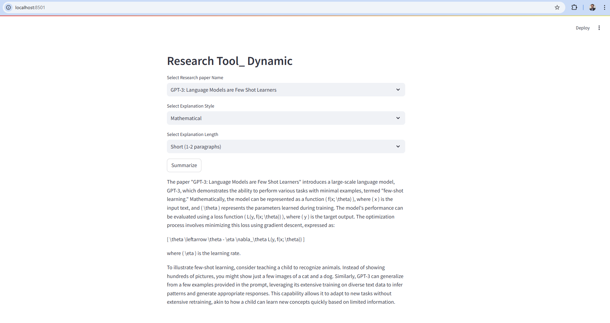

# LangChain 
https://medium.com/@ravi0dubey/langchain-basic-understanding-and-its-components-9a040991bb44

# # Running Static Prompts

Run command streamlit run .\2_LangChain_research\4_prompts_static_UI_.py

We will get URL. Click on the URL. Input screen to enter prompt will be asked
Enter the prompt and click on Summarize button, we will get the output as shown below

## Running Dynamic Prompt

Run command  streamlit run 2.1.3_prompts_dynamic_UI_.py

We will get URL. Click on the URL. Input screen to enter prompt will be asked
Select the type of prompts and and click on Summarize button, we will get the output as shown below

## Using Chains

## Learning Pydantic 

