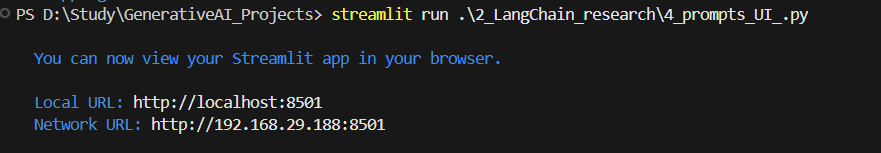
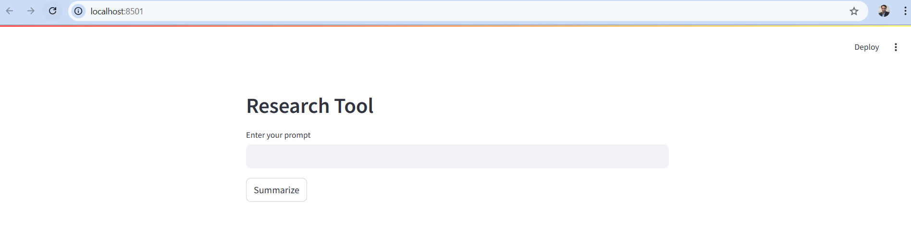
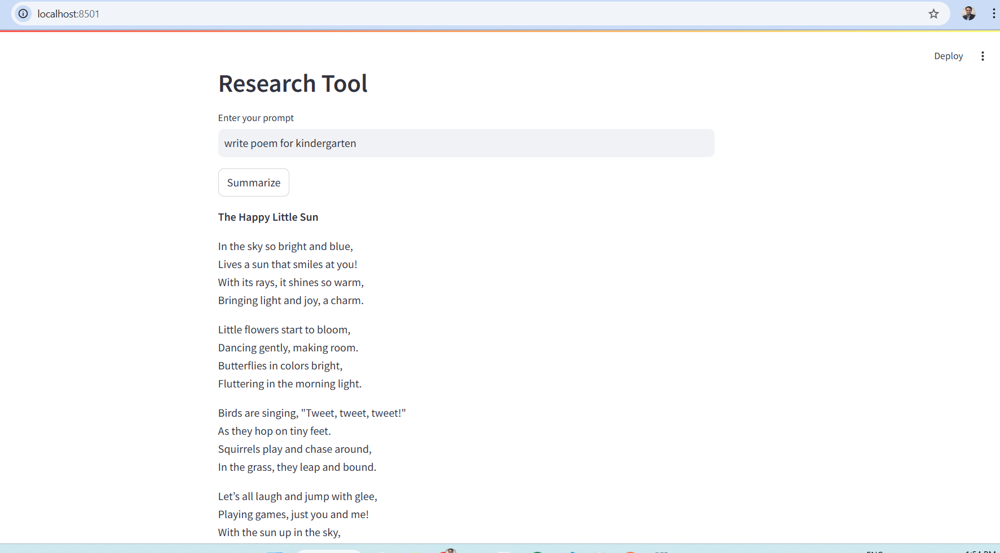
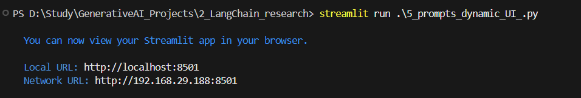
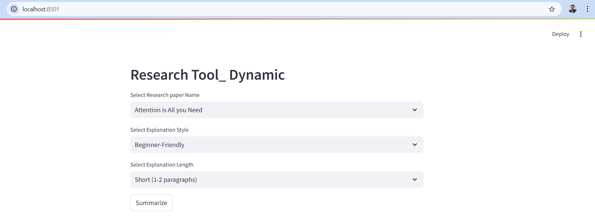
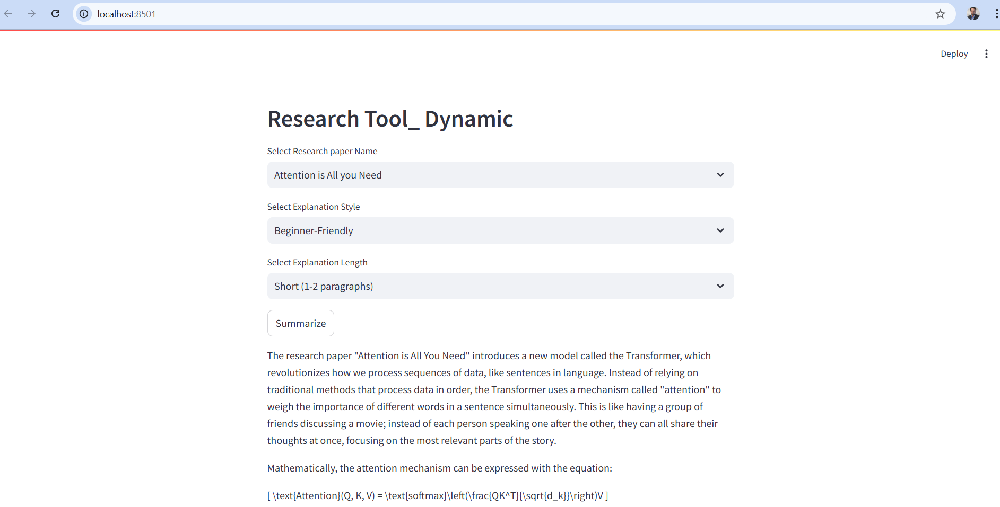

# LangChain 
https://medium.com/@ravi0dubey/langchain-basic-understanding-and-its-components-9a040991bb44

# # Running Static Prompts

Run command streamlit run .\2_LangChain_research\4_prompts_static_UI_.py

We will get URL. Click on the URL. Input screen to enter prompt will be asked

Enter the prompt and click on Summarize button, we will get the output as shown below

## Running Dymanic Prompt

Run command streamlit run .\2_LangChain_research\5_prompts_dynmaic_UI_.py

We will get URL. Click on the URL. Input screen to enter prompt will be asked

Select the type of prompts and and click on Summarize button, we will get the output as shown below
