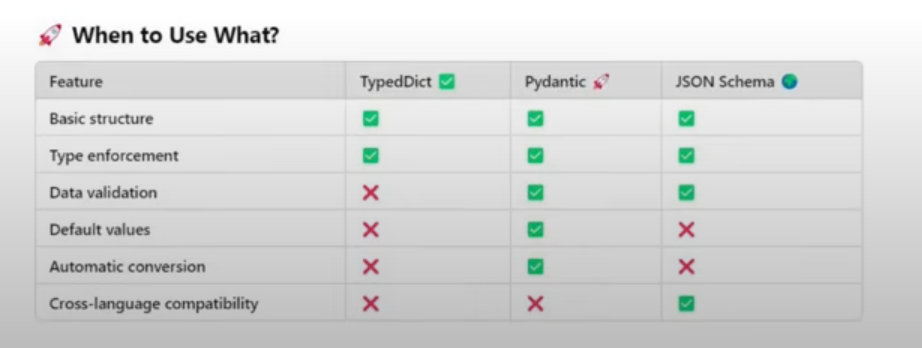
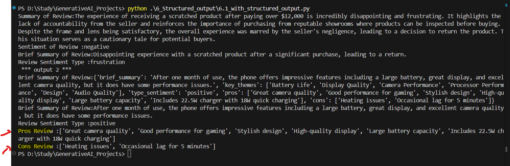
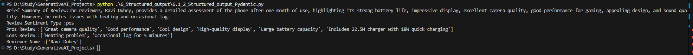
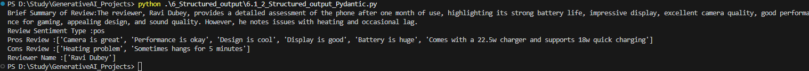

## Structured Output

We are generating structure output from the Models using below mechanism.

### 1. Using Type Dictionary

Type Dictionary for structured output is used when we donot need to do validation and we trust LLM will return correct data.

Getting Structured Output from the Review. Output has
1. Summary
2. Sentiment
3. Brief_Summary
4. Type_Sentiment

Getting Structured Output from the Review with below mentioned Output
1. Key Themes
2. Brief_Summary
3. Type_Sentiment
4. Pros of the review
5. Cons of the review
6. Reviewer Name

### 2. Using Pydantic

We use Pydantic for structured output when we need data validation, or set Default values in case LLM misses the fields as well as when we need automatic type conversion.

Getting Structured Output from the Review with below mentioned Output
1. Brief_Summary
2. Type_Sentiment
3. Pros of the review
4. Cons of the review
5. Reviewer Name

### 3. Using JsonSchema

We use JsonSchema for structured output when we do not want to import extra python libraries. We need validation but not python objects  and when we want output in 
structured standard json format.

Getting Structured Output from the Review with below mentioned Output
1. Brief_Summary
2. Type_Sentiment
3. Pros of the review
4. Cons of the review
5. Reviewer Name

