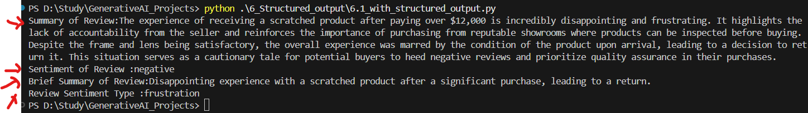

## Structured Output

### 1. Using Type Dictionary

#### using 1. Running for 

Getting Structured Output from the Review. Output has
1. Summary
2. Sentiment
3. Brief_Summary
4. Type_Sentiment

Getting Structured Output from the Review with below mentioned Output
1. Key Themes
2. Brief_Summary
3. Type_Sentiment
4. Pros of the review
5. Cons of the review
6. Reviewer Name

### 2. Using Pydantic

Getting Structured Output from the Review with below mentioned Output
1. Brief_Summary
2. Type_Sentiment
3. Pros of the review
4. Cons of the review
5. Reviewer Name

