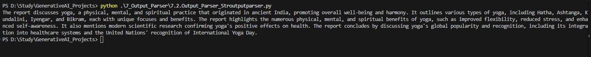
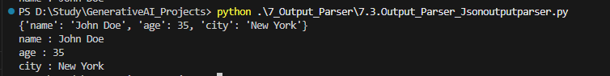

## What are Output Parser
Output Parser help convert raw LLM response into structured formats like
Json, CSV, Pydantic models and more thereby ensuring consistency, validation and ease of use in the applications.

## We have 3 types of Output Parser
1. String Output Parser (StrOutputParser)
2. Json Output Parser
3. Pydantic Output Parser 

### 1 String Output Parser (StrOutputParser)
It parses output of LLM models and return it as plain string.

We create a stringoutput parser in which,  Template1,  which is a prompt1 is passed to the model which generates detailed output. 
Detailed output is passed to string output parser  which extracts text from the detailed report.
Detailed report is send to template2 to generate 2nd prompt which is sent to model to generate summary report.
From summary report , parser will extract the text

chain = template1 | llm_model | string_parser | template2 | llm_model | string_parser

On running code we get below output

### 2 Json Output Parser ()

It parses output of LLM models and return it as Json format.
