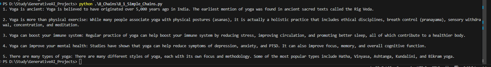
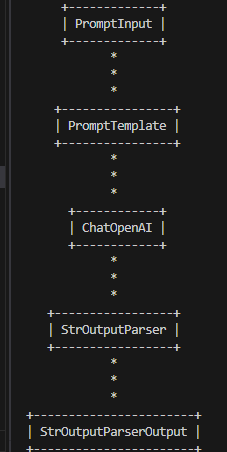

## Chains

Chains are the pipeline of Langchain

If we have a task to take input of English text which is around 1000 words and translate as well as summarize the same into Hindi text in 100 words then we have to manually create a pipeline where we have to set output of one block as input of another block and maintain it manually.

We can simplify the pipeline using Chains.

## We have 4 types of Chains
1. Simple Chains
2. Sequential Chains
3. Parallel Chains
4. Conditional Chains

### 1 Simple Chains()

It simply executes step written in below command 

chain = Prompt | model_openapi | string_parser 

On running code we get below output

We can print the chain graph which looks like below

### 2 Sequential Chains()

It Executes tasks one after another, passing output from one step as input to the next.
Example: Translating English text to Hindi → Summarizing Hindi text → Saving the summary.

### 3 Parallel Chains()

It executes multiple tasks simultaneously, each independent of the other.
Example: Translating English text to Hindi and translating the same English text to French at the same time.

### 4 Conditional Chains()

Executes tasks based on conditions or logic defined in the process.
Example: If input text is in English, translate to Hindi; if input text is in Hindi, directly summarize it.
