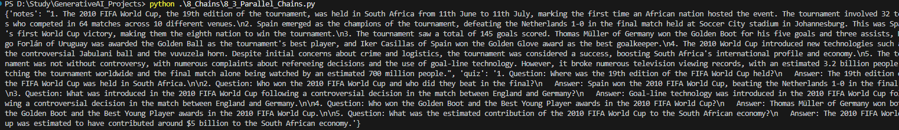

## Chains

Chains are the pipeline of Langchain

If we have a task to take input of English text which is around 1000 words and translate as well as summarize the same into Hindi text in 100 words then we have to manually create a pipeline where we have to set output of one block as input of another block and maintain it manually.

We can simplify the pipeline using Chains.

## We have 4 types of Chains
1. Simple Chains
2. Sequential Chains
3. Parallel Chains
4. Conditional Chains

### 1 Simple Chains()

It simply executes step written in below command 

chain = Prompt | model_openapi | string_parser 

On running code we get below output

Chain graph looks like below, it has prompt input -> which fills prompt template ->   which is used by llm model-> output of llm model is extracted by string output parser and we get the output

### 2 Sequential Chains()

It Executes tasks one after another, passing output from one step as input to the next.
Example: Creating a detailed report  → Extracting 5 pointer summary from the detailed report.

chain = prompt1 | model_openapi | string_parser | prompt2 | model_openapi | string_parser

For above command of sequential chain, below steps works.

Prompt1 is passed to the model which generates detailed output about the topic. 
Detailed output is passed to string output parser which extracts text from the detailed report.
Detailed report is send to prompt2 which is sent to model to generate 5 pointer summary from the detailed report. From summary report , parser will extract the text.

Chain graph looks like below, it has prompt input -> which fills prompt template ->   which is used by llm model-> output of llm model is extracted by string output parser -> it fills prompt2 -> which is used by llm model-> output of llm model is extracted by string output parser and we get the output

### 3 Parallel Chains()

It executes multiple tasks simultaneously, each independent of the other.

####  Step 7.1 Create Parallel chain using RunnableParallel which does two task parallely
####     a. Task1 : Prompt1 is passed to the model which generates detailed output about the topic. 
####     and Detailed output is passed to string output parser which extracts 5 notes from the detailed report using prompt2
####     b. Task2 : Prompt2 is passed to the model which generates detailed output about the topic. 
####     and Detailed output is passed to string output parser which generates quiz from the detailed report using prompt3.

####  Step 7.2  Create Merge_chain which uses prompt4 to merge output of task1 and task2 into one

####  Step 7.3  Create a final chain which runs parallel_chain and merge_chain in sequence.

parallel_chain = RunnableParallel(
    {'notes': prompt1 | model_openapi | string_parser | prompt2 | model_openapi | string_parser ,
     'quiz' : prompt1 | model_openapi | string_parser | prompt3 | model_openapi | string_parser
     }
)

merge_chain = prompt4 | model_openapi | string_parser 

final_chain = parallel_chain | merge_chain

Chain graph looks like below, it has prompt input -> which fills prompt template ->   which is used by llm model-> output of llm model is extracted by string output parser -> it fills prompt2 -> which is used by llm model-> output of llm model is extracted by string output parser and we get the output

### 4 Conditional Chains()

Executes tasks based on conditions or logic defined in the process.
Example: If input text is in English, translate to Hindi; if input text is in Hindi, directly summarize it.
