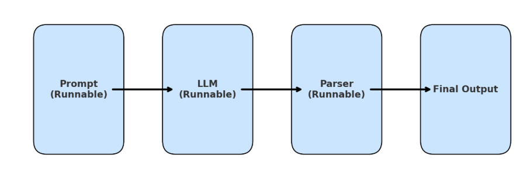
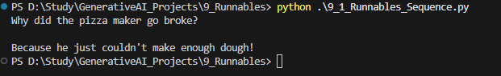

## Runnables

Runnables are a flexible, composable, and standardized way to build chains, replacing the older Chain class.

Here’s a simple diagram of a LangChain Runnable pipeline: each step (Prompt → LLM → Parser) is a runnable, and arrows show how they’re chained together into a flow.

## We have 4 types of Runnables
1. Sequential Runnables
2.

### 1 Sequence_Runnables()

It simply executes step written in below command 

chain = RunnableSequence(prompt,model_openapi,string_parser)

On running code we get below output

### 2 