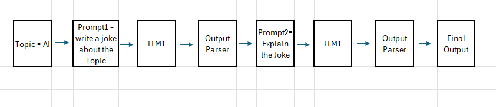
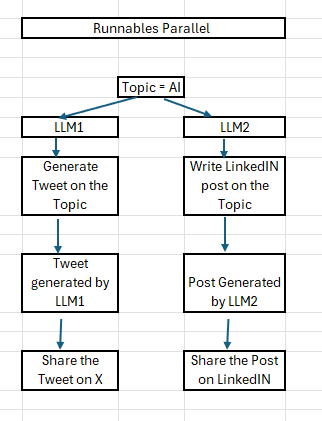
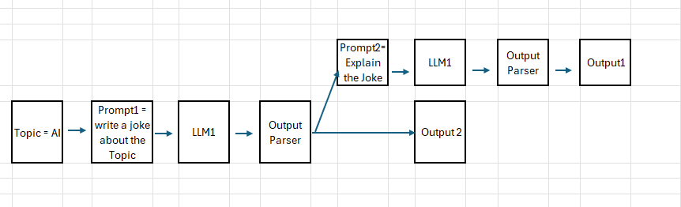
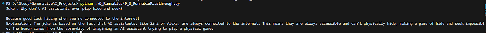

## Runnables

Runnables are a flexible, composable, and standardized way to build chains, replacing the older Chain class.

It is divided into two parts
1. **Task specific Runnables** -> These are LanChain Core Components which are used to perform specific task like LLM calls, prompting etc.
Examples
a. ChatOpenAI -> Runs an LLM Model.
b. PromptTemplate -> Formats prompts dynamically.
c. Retriever -> Retrieves relevant documents.

2. **Runnable primitives** -> 

## We have 4 types of Runnables
1. RunnableSequence
2. RunnableParallel

### 1 RunnableSequence()

It is a sequential chain of runnable which simply executes step in a sequence, passing the output of one step as input to the next. Generally used when we need to compose multiple runnables together in a structured flow.

chain = RunnableSequence(prompt1,model_openapi,string_parser,prompt2,model_openapi,string_parser)

On running code we get below output

### 2 RunnableParallel
It is a runnable Primitive that allows multiple runnables to execute in parallel. Each runnable receives the same input and process it independently and in parallel sequence, producing a dictionary of outputs.

parallel_chain = RunnableParallel({
 'tweet': RunnableSequence(promptX,model_openapi,string_parser), 
'LinkedIn' : RunnableSequence(promptL,model_openapi,string_parser)})

On running code we get below output

### 3. RunnablePassthrough
It returns input as output. Very helpful when we also want the output from LLM in its originality along with some processing done on input.
Eg:
When we want to get a Joke and the explanation of the joke in such case, original joke can be retrieved using RunnablePassthrough while explanation can be retrieved using RunnableSequence.

joke_gen_chain= RunnableSequence(prompt1,model_openapi,string_parser)
parallel_chain = RunnableParallel(
{ 'Joke': RunnablePassthrough(),'Explanation' : RunnableSequence(prompt2,model_openapi,string_parser)})
final_chain = RunnableSequence(joke_gen_chain,parallel_chain)

On running code we get below output
